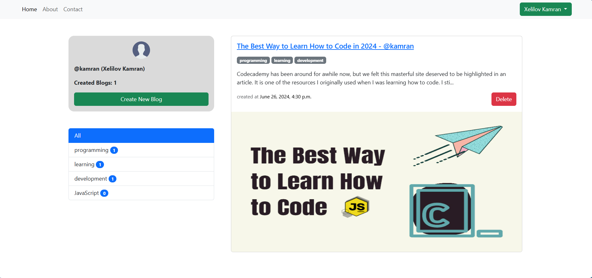
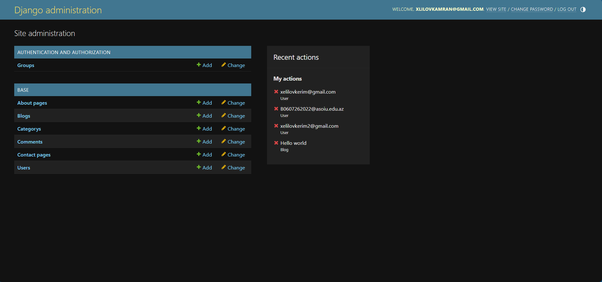

# Bloag App

This Django-based web application is a simple yet powerful blogging platform. It allows users to create, delete, and publish blog posts with ease. The application supports features such as categorizing posts, managing user likes on posts, and displaying posts based on selected category.

## Table of Contents

1. [Installation](#installation)
2. [Features](#features)
3. [Technologies Used](#technologies-used)
4. [Usage](#usage)
5. [Demo](#demo)

## Installation

To run this project locally on your machine, follow these steps:

1. **Clone the repository:**

```bash
git https://github.com/xelilovkamran/blog-app-intern-project.git
cd blog-app-intern-project/
```

2. **Create a virtual environment:**

```bash
   python -m venv env
```

3. **Activate the virtual environment:**

    - On Windows:

        ```bash
        .\env\Scripts\activate
        ```

    - On macOS and Linux:

        ```bash
        source env/bin/activate
        ```

4. **Install dependencies:**

```bash
   pip install -r requirements.txt
```

5. **Apply migrations:**

```bash
   python manage.py migrate
```

6. **Create a superuser (admin user):**

```bash
   python manage.py createsuperuser
```

7. **Run the development server:**

```bash
   python manage.py runserver
```

The application will be accessible at http://localhost:8000/.

## Features

-   **User Authentication**: Secure user authentication system using Django's built-in authentication framework.
-   **Blog Post Management**: Create, and delete blog posts with rich text content using Django admin or a custom interface.
-   **Categories**: Categorize blog posts into different categories for better organization and navigation.
-   **Image Upload**: Support for uploading and displaying images associated with blog posts using Django's `ImageField`.
-   **Likes**: Allow users to like blog posts, with a count of total likes displayed on each post.
-   **Timestamps**: Automatically record and display creation timestamps (`created_at`) for blog posts.
-   **Responsive Design**: Ensure the application is responsive and accessible across different devices and screen sizes.
-   **Admin Interface**: Utilize Django admin for easy management of users, blog posts, and categories.

## Technologies Used

-   Django
-   Python
-   HTML/CSS/JavaScript
-   Bootstrap
-   SQLite
-   Toastify.js
-   Other relevant technologies

## Usage

-   Admin Interface: Access the Django admin panel at http://localhost:8000/admin/ to manage users, blog posts, and categories. Log in with the superuser credentials created earlier.

-   Creating Blog Posts: Navigate to the admin panel, click on "Blogs" and then "Add Blog" to create new blog entries. Fill in the title, content, select categories, and upload an image if desired.

-   Viewing Blog Posts: Visit the home page (http://localhost:8000/) to see a list of published blog posts. Click on a post title to view its full content.

-   Liking Blog Posts: Logged-in users can like a blog post by clicking the "Like" button below each post. The number of likes will update dynamically.

### Screenshots





## Demo

You can view the live demo [here](https://kamran00.pythonanywhere.com/)
